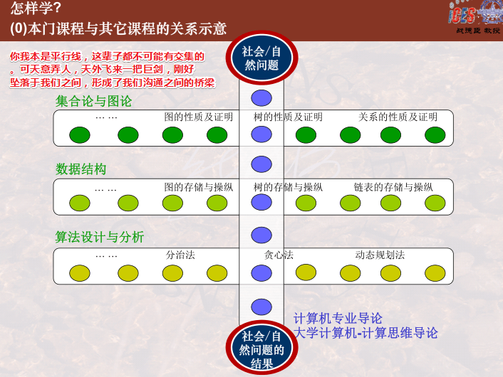
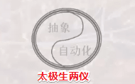
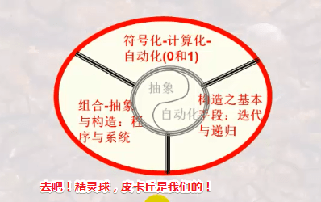
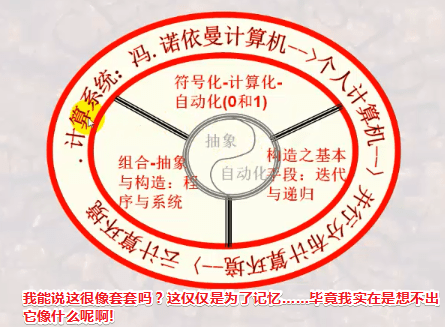
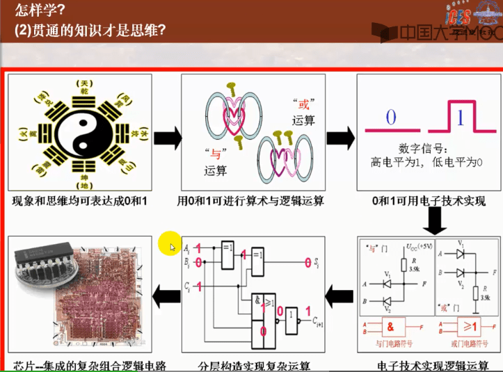
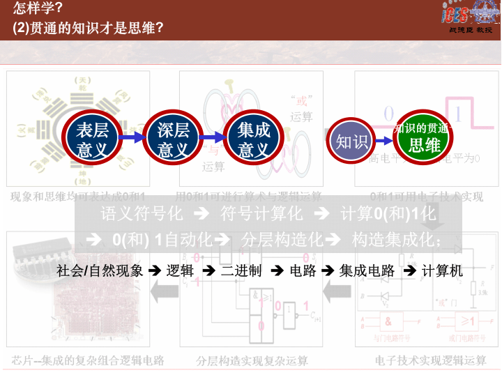
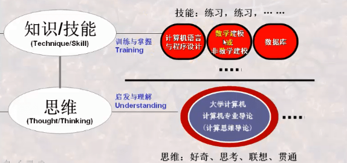
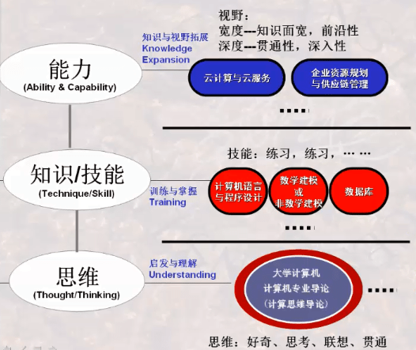
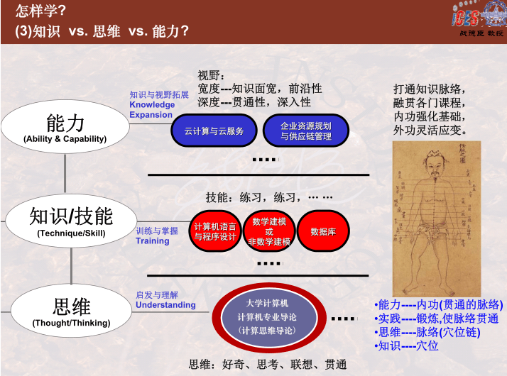

# 怎么学计算机专业导论？

继为什么学、学什么后，来到怎么学了……这节会让你明白什么是内功？

## ★本门课程与其它课程之间的关系

### ◇其它课程

> 其它课程内容通常来讲都是横向组织教学内容，比如说集合论与图论，它会一个知识点一个知识点的来给大家进行讲解，比如说讲解图的性质及证明、树的性质及证明、关系的性质及证明等等，我们说这是一种横向的组织。
>
> 再比如说数据结构，那么他会讲图的存储与操纵、树的存储与操纵、链表的存储与操纵等等。

### ◇本门课程

> 对于我们这个课程来讲，它是一种纵向组织内容，通过贯通，让大家了解从社会/自然问题，通过我们这些课程的这种知识如何贯通起来，获得社会/自然问题的这样一个结果，使你理解、这种各个知识点的、这样一个作用，因此我们对每一个知识点上并不做横向的延展，而是做纵向的贯通，这是一个很重要的一点的一个概念，也是很重要的特点

### ◇总结

> 我们说横向的这种多少体现了我们知识的一种广度覆盖面。而我们说纵向的这种，即这样一种长短体现了一种深度，本门课程重在深度，而不在每个知识点它的这种细节的讨论。既强调大思维与小细节，强化这种大思维的这种理解，有些小细节不理解没有关系，可能后面我们还会继续学习，但这些知识点贯通就是我们这门课的要做到、要理解的。
>
> 

## ★知识构建次序

> 那么进一步我们来看，怎样构建计算机学科的一些知识，怎么样构建本门课的知识，因为我们都是初次来学习。 我们来看我们可以按照这种次序来构建。 

### ◇抽象和自动化

> 我们说计算机学科**最本质的就是抽象和自动化的学习**，那么抽象就是学会理解、区分、命名、表达，学会讲现实中的社会/自然问题，表达成我们说计算机、计算机器可以求解的这样一些形式，而自动化就是让机器代替人进行求解，我们要设计、构造和应用这样的机器。 
>
> 

### ◇最能代表太极（抽象和自动化）的3个方面

> 在这个基础（太极）上，最关键的内容，实际上我们说就是体现了三个方面。这三个方面也可以说最能代表抽象与自动化的。

#### 符号化-计算化-自动化

> 一个呢？我们就是符号化、计算化与自动化，就是我们前面一棵树上的「0和1」的思维 

#### 组合-抽象与构造

> 另外一个呢？就是组合-抽象与构造，这是关于程序和计算系统的思维。我们说计算系统最核心的就是能执行程序的这样一个系统。

#### 迭代与递归

> 那么第三个讲呢？就是在构造程序的过程当中，**最核心的最基本的手段就是迭代和递归** 

#### 总结

> 我们说这三种思维是非常重要的思维，我们要先学好，**理解透彻以后，我们再来学习下一方面的内容** 
>
> 

### ◇计算系统

> 那么进一方面的内容，我们就要理解计算系统、理解机器是如何执行程序的、理解程序被机器执行它的一个原理、理解机器执行程序的一些环境，那么这些方面，无论是我们将来进一步的这种进行程序设计的学习，还是其它课程的学习都很重要。所以在这个方面当中，我们要学习冯诺依曼计算机、个人计算机，进一步延展到并行分布计算环境和云计算环境。 
>
> 

### ◇问题求解之算法与程序设计

### ◇网络化思维

### ◇数据化思维

### ◇面向某类学科/方向的计算

### ◇没有内容的这4点概述

> 那么在此基础上我们要进一步学习的就是问题求解的算法与程序设计，再学习网络化思维，再学习数据化思维。
> 我们说这些思维的学习通常都要**结合某一类计算、某一类社会/自然问题，结合起来学习是非常有意义的**。所以在这里面来讲，我们说像这些内容：如何结合计算物理学、智能计算、神经计算、计算经济学、社会计算、计算生物学、计算农林学、社会计算、嵌入计算、企业计算、服务计算等等，结合这些问题来学习，这是非常重要的一个方面，一个非常重要的方面。
>
> 那么这张图呢？给我们反映了计算机专业导论课程的知识的构建次序，实际上它也是我们计算机科学与技术学科整个大的学科当中的知识的一个构建次序。
>
> 

## ★贯通的知识才是思维？

> 那么怎么样学习呢（关于知识构建次序图的学习）？什么是思维呢？我们说贯通的知识才是思维。
>
> 
>
> 我们说这张图——具体的细节内容，我们将在第二节当中给大家介绍，我们这里先不去细化的理解它。 
>
> 实际上这张图反映的是一种思维，我们说零和一的思维。 

### ◇这张图为我们揭示了什么？

> 那么我们看这张图，它为我们揭示的是什么呢？揭示的是：由社会/自然现象→☞逻辑→☞二进制→☞我们说电路，再到集成电路，最后到计算机，也就是说揭示了如何由社会/自然现象、社会自然问题，最后到用计算机求解的整个的这样一个思维。所以体现出来，我们说就是语义符号化→☞符号计算法→☞计算0（和）1化→☞0（和）1自动化→☞分层构造化和构造集成化，那么具体内容我们后面去学习 ……
>
> 

### ◇从图的揭示里强调几点

> 一个就是怎么样学习？我们说通过这张图，我们可以描述如何来学习 

#### 表层意义-深层意义-集成意义

> 第一个我们学习它的表层意义，比如说我们这张图的左上角它是一个易经，用易经来表示的抽象，我们说这里面表层意义就是「什么是易经？」这个你要理解，易经的几个概念我们要理解。
>
> 但是我们说这个易经并不是我们这门课要求的内容，实际上我们要通过这种易经，我们要能理解它这种深层的含义，这些深层含义的理解才是最关键的。比如说我们要通过这个易经，实际上反映的是一种符号化、抽象化、计算化，它反映的是符号、组合来表示一种计算，所以这种深层含义是很重要的。
>
> 另一方面就是将易经这张小图，放到这张大图里面，它所反映的一种集成的意义。而这种集成意义对大家来讲很重要，实际上深层意义和集成意义的理解对我们这门课很重要，也是难点所在，因为我们说**表层意义的理解很容易，但是深层意义、集成意义是需要我们不断的悟的！不断的悟的！**这是一个很重要的问题。 
>
> 

### ◇知识的贯通？思维？？

> 那么通过这张图我们可以看到什么是思维？在我们这里来讲，我们把贯通的知识称为叫做思维，因为我们说若干年以后，在这里面的细节内容我们可能早已忘掉了，但是我们由社会/自然现象→☞逻辑→☞二进制→☞电路→☞集成电路→☞计算机这样的一个思维，这样一个过程我们却是忘不了的，而我们说几十年以后、几年以后、几十年以后忘不了的东西，实际上对于我们来说，这才是一个思维，所以我们说知识的贯通就是思维，我们要学习如何贯通这种知识。 
>
> 

## ★知识vs思维vs能力？

> 那么进一步来看思维和知识和能力之间的关系。

### ◇思维

> 我们刚才说了，我们在大学阶段，那么贯通知识是一个很重要的方面，这种贯通可能在我们还不具有很细致的知识的前提下，我们来学会贯通，这是一个很难的一件事情，但是我们是必须要做的，因为我们要抬头看路，不可能我们都走过去了以后我们再回头来看，所以只能在很多的细节不清楚的情况下我们来看，所以我们要学习思维。**思维重点是启发与理解**，**好奇、思考、联想、贯通，所以我们说大学的第一门课程，我们说应该学习计算思维，学习计算思维，这也是我们这门课的一个特点**，也是我们这门课的一个目标。
>
> 

### ◇知识/技能

> 那么在有了一定的思维的前提下、基础上，那么我们可以不断的学习知识和技能，比如说：我们要学习计算机语言程序设计、数学建模、非数学建模、数据库，而**这些方面的知识和技能，那么更多的是在我们计算思维的指导下，不断地这种练习、练习、再练习才能掌握的！才能掌握的！**换句话说，像这样一些内容，它不是说简简单单地学，而是要更多地练。所以知识/技能是通过练习，训练与掌握的 
>
> 

### ◇能力

> 那么进一步呢，实际上我们在后期会有一些这种视野拓展、知识拓展的这样一些课程，那么当我们能够在这些知识拓展，在这些技能训练基础上，我们可以把这种思维转化成能力！啊转化成能力，所以在这里面来讲，这是思维、知识/技能和能力之间的关系。 
>
> 

### ◇打个比方理解这三个点的关系

#### 知识点-穴位

> 我们给大家打一个比方，比如说：**我们人身体上，我们有若干个穴位，这一个一个穴位，就是一个知识点。一个穴位就是一个知识点。**

#### 思维-脉络

> **而若干的穴位，它们之间的这种脉络，我们称为叫做思维，称为叫做思维，所以我们把贯通的脉络称为叫做思维。**

#### 实践-锻炼，使脉络贯通

> 但是真正能够贯通这样一个脉络，使这些气息在这些穴位之间来回这种游走，我们说这个时候，这是需要不断的锻炼的，那么这就需要实践。那么通过不断的练习，使得气息在这里面不断地这种游走。

#### 能力-内功（贯通的脉络）

> 这样的话，**我们说当你经过日积月累这种训练以后，你可以将这种思维转换成能力，所以我们说将这种能力，我们把它称为叫做内功，实际上是贯通的脉络，贯通的脉络。**那么思维呢？就是一些穴位链，也就是这些穴位要贯通起来，那么我们要知道，但是我们知道，但能不能够做到呢？能够做到的话，就必须要经过不断地练习。

### ◇我们这门课的学习

> 所以我们把这样一种内容——我们这门课的学习，我们可以理解为**打通知识脉络，融贯各门课程，内功强化基础，外功灵活应变。**那么所谓的外功就是我们不断接触到的一些软件、硬件的应用，所谓的外功就是我们要学习的一种计算机语言及其程序设计，那么像这样一些内容，在我们有了内功的基础上，那么它才能更好地发挥出来！更好地发挥出来。
>
> 

## ★总结

- 通过思维贯通（连接）那些游离的知识点，这是点到线的过程，而这根线就是思维了；通过不断地实践使思维贯通，这是线到面的过程，这个面就是能力了，这个面也叫做内功。
- 有了内功，那些外功诸如软硬件的应用、计算机语言及其程序设计，才能更好地发挥出来！
- 多看知识构建次序图……
- 之前你一直说「无法将零碎的知识点组织起来」，那么现在我想你应该知道原因了吧！即缺乏一种思维，而且即便有了这样一种思维，也还得要不断地练习，才能把这些知识点转化成一种能力，有了这样一种能力，那么**知识学习的速度跟不上计算学科知识膨胀的速度**的矛盾，就迎刃而解了……

