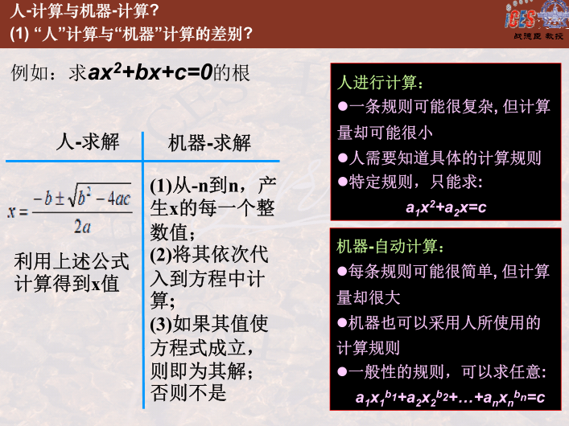
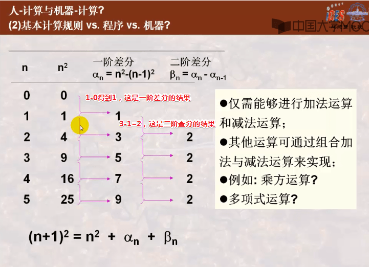
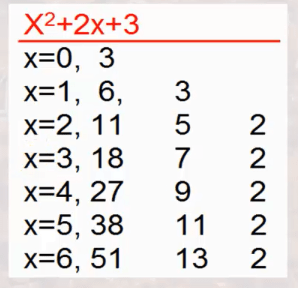
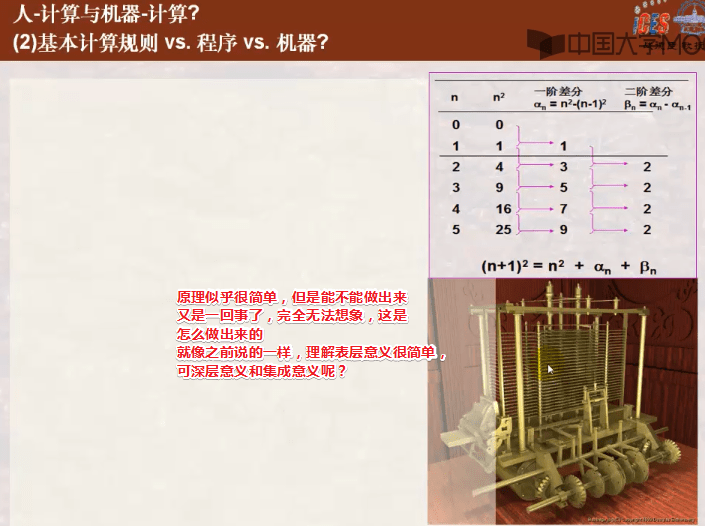

愚蠢的人类！颤抖吧！我们机器一族就是闲得慌，不像你们人类，为了方便计算需要找各种计算规则，而且有的复杂的要命！而我们只需要一条简单的规则，就能算出结果了，即便计算量大，可我们就是任性！不差钱！！！

# 人计算与机器自动计算（上篇）

## ★「人」计算与「机器」计算的差别？

### ◇讲解这张图

人计算与机器计算到底有啥差别？通过举个栗子来解释其差别。

#### 求ax^2^ +bx+c=0的根

##### 「人」求解

关于求一元二次方程的根，我们在初中都学过了，比如有个叫求根公式（把参数带进来，那么其根就出现了，当然这还需要判断这个方程有没有根才可以）的，至于这个公式的推导过程，我早已忘记。

##### 「机器」求解

我的天，机器竟然也能求解！如果机器不知道这个求根公式能不能求解，那它还能求解呢？可以，可以采用图上的那种方式——代入法。显然机器可以采用一种笨方法！这让我想起了，几何题里的「求这条边的长度」问题的时候，我用把尺子一量，就写上了答案，这显然也是种笨方法！

机器这样代入的求解思维和人求解的思维是不太一样的！

##### 二者的差别

第一个：

我们可以使一条规则变得很复杂，但是我们计算量呢？却可能很小。为什么呢？毕竟只需要把方程的系数代入到求根公式里，就可以得到根了。

机器有可能不能处理这么复杂的规则，如求根公式。那该怎么办呢？别忘了，机器是可以使用每条都很简单的规则的，而且这样的机器也是能造出来的。但是这样简单的规则计算起来，它的计算量却很大！可这也正是机器的这样一个特点——我（机器）不怕量大就怕复杂！

------

第二个：

人要在求解一元二次方程的根的时候，是必须要知道具体的计算规则的。而这种规则对于机器来讲呢？机器也可以用这种规则，当然我们需要将这种规则转化成一些程序，让机器可以识别！

------

第三个：

我们这样一个规则只能求解……「比如说这个求根公式，它只能求解一元二次方程。」，类似于「a~1~x^2^ +a~2~x = c」这种形式，那么对于一般方程来讲，能不能求解呢？

对于机器求解这种思维来讲，对于这种一般性方程（任意元，任意次的方程。ps:这个长相的请看上方的图），实际上，机器都可以进行求解。

这也说明在有一些问题，数学上还没有给我们找到「求解简单的」这种求解方法的时候，我们可以采取利用简单的规则，让机器来自动的求解。我们说这是一个很重要的、研究自动计算的、这样一个思维 。那么它可以帮助人们解决一些数学上的一些、计算上的一些难题。 

## ★基本计算规则 vs 程序 vs 机器？

### ◇讲解这张图

这是用差分法来计算[乘方](https://baike.baidu.com/item/%E4%B9%98%E6%96%B9/9539611?fr=aladdin)（求n个相同因数乘积的运算，叫做乘方，乘方的结果叫做幂 ），比如我要计算一个数的平方，一般我们都是直接n*n这样计算，但是我们可以通过简单的计算规则，把这个乘方计算出来。那么怎么算呢？这需要给出几个初始值才行，如0的平方0、1的平方1、2的平方4，这几个值是必须要给出来的。接着，后一个数减去前一个数得到一个差分，这个差分我们称为一阶差分。同理，更进一步来看，一阶差分的相减，就得到了二阶差分。

有了初始值和计算差分的方法，那么我们在计算3的平方的时候，就可以这样算了，4+3+2，即上一个数的平分+其对应的一阶差分和二阶差分。这样的一种规则，可以用上图那个公式表示，而这种规则其实是很简单的，即我们只需要减法运算和加法运算，就可以计算出这么一个乘方。

这种规则的特点：

1. 只需要加法运算和乘法运算，就能计算出那么一个乘方
2. 其它运算则可以通过组合加减法运算来实现

除了可以做到乘方以外，还能不能做到其它运算呢？比如说多项式运算

### ◇多项式运算

这个同样可以用上面那种规则来算，首先需要事先给出3个初始值才行，如3、6、11，通过这三个初始值的差分计算，可以得到2个一阶差分，借此得到1个二阶差分。那么当x=3的时候，就不需要代入值进去求结果了，直接通过上一次x=2的结果+一阶差分+二阶差分，就可以得到x=3的结果了。

这样一来，求当X等于某一个值的，求该多项式的值的时候，如果以前的多项式求出来了的话，那么加上一阶差分和二阶差分可以得到结果了，如x=6，而你有了当x=4和x=5时，多项式的结果，那么x=6的结果就显而易见了。 

### ◇总结

附上一张完整的图：

这两个例子(乘方运算和多项式运算)都有想通的地方，即只要我们给出初始的值，我们就可以用前一个值+一阶差分+二阶差分，就可以得出后一个值了啊！那么这种计算方法，我们说这是差分法求多项式的值。还有就是大家可以看到，初始值不一样，计算的多项式也是不一样的。

这TM让我想起了递归，而上述的计算规则，恰恰如递归的后半生一样！！！（递归的前半生在找初恋（初始值），后半生则是为与初恋结婚而努力奋斗（得到结婚的结果））

## ★差分机

能不能根据上述的规则，做出一台机器呢？实际上我们说巴贝奇就是利用这种差分的原理 ，可以实现了求解多项式。这个差分机，用齿轮表示了一些数字，通过齿轮间的啮合「niè hé 」来去表示一些差分运算和这种加法运算。所以他制造了第一台，我们说能够编写一定程序的、可以变化规则的一台计算机，那么这台计算机在计算机历史上是很有意义的。 想要深入了解差分机？就看这篇文章——[来看看古老的蒸汽电脑——差分机](http://baijiahao.baidu.com/s?id=1558636995026259&wfr=spider&for=pc)。我看了一眼，就是两个字——复杂……

## ★总结

- 了解了差分法是什么
- 简单的规则可以让机器来做，反正机器闲得慌

