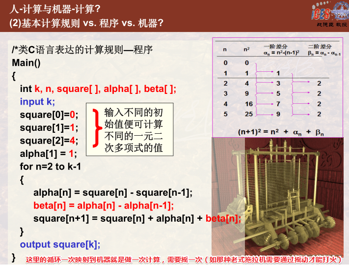
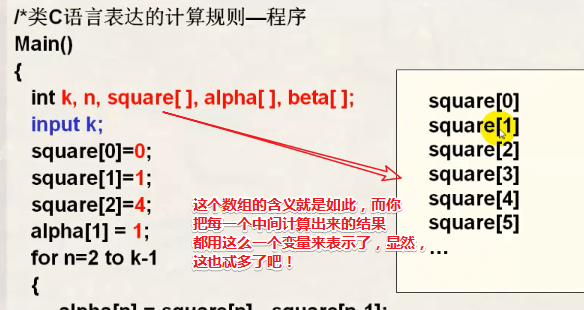
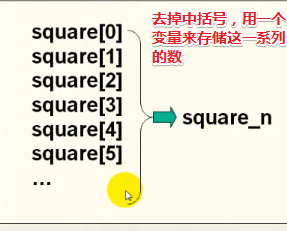
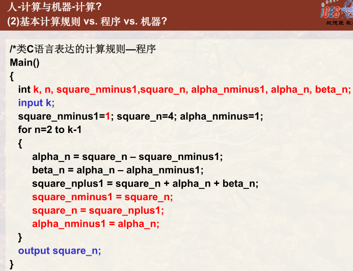
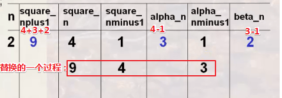
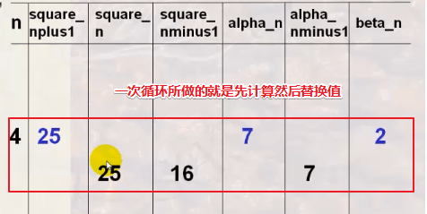
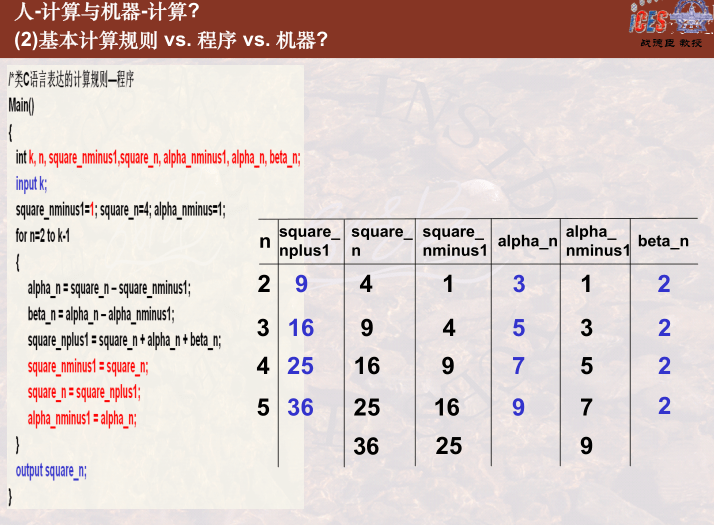

这是下篇，而这一篇讲到了如何根据机器的规则，来写一个类C程序，即让程序和机器产生关联……

## ★基本计算规则 vs 程序 vs 机器？



### ◇解释这张图

我们是否可以用程序来表达这样一种思路（计算规则）呢？可以吗？试一下呗！

用C语言吗？可是没学过啊！不过这没有关系 ，我们可以用类C语言（不一定是C语言，只是类似）来编写这样一个程序。

#### 开搞这个程序

固定格式，有个Main的家伙，它有一个()和{}，即小括号和大括号，这有啥用呢？不要纠结这点，以后会讲到，那个时候你就会明白了！你只需要知道程序是放在这个{}大括号里面就可以了！

为了用差分法计算多项式的值或者乘方的值，那么就得要一些变量来存储那些必要的初始值才行，在这里定义了5个int类型的变量，square[]是一个数组，它存储了第n个的平方值（n的取值为0到正无穷），这些变量的内涵和格式在这里就不具体解释了！

`input k;`表示输入一个k，然后与之对应的是 `output square[k]`，表示输出一个k的平方。这个就让我想起了JavaScript（还有其它一些语言也是如此）里的函数中的形参和return了。

如何计算 `square[k]`呢？

首先需要直接给出4个初始值才行，为此才可以通过公式计算出下一个值！如求一阶差分的`alpha[n]=square[n]-square[n-1]`、求二阶差分的`beta[n]=alpha[n]-alpha[n-1]`，由此可得到，`square[n+1]=……`，这就是求解某一个乘方的这样一个公式，说实在的，起初我是不明白的，因为我觉得n会有冲突啊！为什么？一个n在3个公式里游玩，感觉会发生变化，然后仔细一想，n就是「万花丛中过，片叶不沾身」啊！

说到这3个公式，是可以用这种机器，这种设备（图中的差分机）来给它自动的实现

如何做到n→☞n+1的计算呢？由此得到k呢？

为了得到`square[k]`的结果，需要前面的数一直加起来才能得到的，所以必须要让机器不断地重复去执行那三条公式（那三条语句）才行，于是有了 `for n=2 to k-1{……}`这样一种循环执行某个动作的表达方式，通过这种方式就可以得到 `square[k]`的结果了。如果把这个循环动作映射到机器上的话，那就是摇一次，n加了一个1，摇 `k-1-2`次就能得到`square[k]`的结果了，如k=5，那么我就需要摇3次……

这让我想到了：

```javascript
for(let n = 2; n < 5; n++){console.log(1)} //输出了3个1，即执行了3次循环动作
for(let n = 2; n <= 5; n++){console.log(1)} //这里是执行了4次循环动作
```

关于循环的边界问题，真是件操蛋的事啊！上面我说要摇3次，是指忽视了n=2这种情况，即循环动作总共执行了n次，就得摇n-1次。

我们可以看到：

1. 循环这个动作执行到最后一次，那么`square[n+1]`就是这个`square[k]`了，这就是为什么循环的终点是 `k-1`的缘故了

2. 如果我们知道机器是如何工作的，这个程序是如何被机器执行的，那么写这样一个类C程序、理解这样一个程序应该说还是非常容易的

   **为什么不会写demo？不能理解这个demo？那是因为你不知道这个程序在某个环境里，是如何被执行的！而且你也不知道这个环境是如何工作的！即一个针对执行程序的大boss工作机制，一个针对大boss对某一个程序的应用**

3. 在这里面我们可以看到，巴贝奇就是利用这样一种思路(**机器的工作机制和程序是如何关联到机器的**)来实现了一台计算机，来完成了这样一个计算

4. 如果我们输入不同的初始值，那么便可计算不同的一元二次多项式的值了。所以我们说巴贝奇这个差分机是具有一定的、可变化规则的这种能力。**我们要很好地理解机器规则是如何来进行表示的**！（后面会进一步总结）如这个类C程序和摇一摇的机器规则……

5. 类C程序存在优化的可能性，如需要用那么多数组吗？


## ★改造类C程序

### ◇不需要那么多个变量

之前我们用数组来表示，第0次、第1次到……第n次的计算结果，即square[0]、square[1]……square[n]，可见你搞了那么多个变量出来。

就像是这样子：



ps：图中的「表示」二字，用「存储」二字替代

那么我们能不能减少这些变量的数目呢？，而只用一个变量来存储呢？这是可以的，如这个样子：



### ◇对程序进行修改



第一步，这里定义的一些变量都不是数组变量，而是一个变量，即用独立的变量而不是用数组的形式来存储中间计算过程中得到的值。

第二步，搞定输入的是什么，输出的是什么。

第三步，给第一步的那些变量中的那3个变量（ps：看图）赋上初始值。

第四步，通过计算规则得到了 `square_nplus1`（这个变量没有声明啊！在图中），然后就是根据计算得到的中间值，去替换原先的初始值了啊！这样一来，依旧是这几个变量在「兴风作浪，无法无天」了啊！

**这是用一个变量替换的这么一个过程**

第五步，用循环。从n等于2到等于k-1的计算过程中，不断地循环，我们可以用一个变量来实现一个数组的这样一个能力。

### ◇模拟程序执行

这个程序是否会按照我们的要求来执行呢？我们可以来模拟一下。如下：



每一次计算完了以后，都会得到一组值。也就是说，这个机器只保留当前计算的一组值。说白了就是**铁打的变量，流水的值……**就像是这样：



当n=4的时候，实际上我们计算出的是5的平方25，说白了就是25已经放在了`square_n`当中了。这就是为什么循环的终结点是k-1的缘故了，如你要计算6（k）的平方，只要2to5（k-1）就能得到36了。最后输出的就是 `square_n`的值，而不是`square_nplus1`的值，我想这就是为什么战老师没有把`square_nplus1`当作是个全局变量给声明出来，而是把它作为一个局部变量或者说是个中间变量、临时变量……

### ◇一张图告诉你模拟程序执行的过程



这次程序改造，实际上来讲，大家可以看到，这反映了：我们说用一个变量来代表一系列变量，应该说巴贝奇差分机很好地解决了这样的一个问题，通过这种迭代的方法，来实现了一个计算多项式的这样一个机器，我们说这个想法是很巧妙的，关于迭代的思想后面还会给大家介绍……


## ★总结

- 如果你要想学会写demo，理解某个demo，那么这个demo是如何被执行的？你得知道。有哪些参与执行这demo的家伙？你得知道，而且你得要知道这些家伙工作机制才行，如你用JavaScript编程，那么v8引擎是需要你去了解的，可是了解这个你肯定得要有对计算机的执行与构造有一定了解才可以吧！至于语言的语法？孰能生巧，即多敲demo，多去仿照他人写的优秀demo，然后总结归纳。总之就是 **多思考多练习**
- 加深了对临时变量（`square_nplus1`）以及迭代思想（铁打的变量流水的值）的认识
- 如果你想要模拟程序的执行，可以参照图中的方式去做，即只需要关注一次执行过后，或者说一次风雨过后，这个变量存储的是什么，这自然风光是怎样的！
- 同一个问题，也许很多种编程语言都可以做到，如给我打印一个Hello！World！出来……我想编程语言都是基于机器规则而一步一步迭代而出现的


