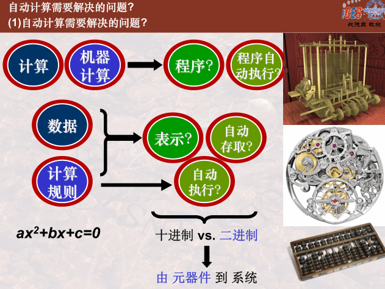
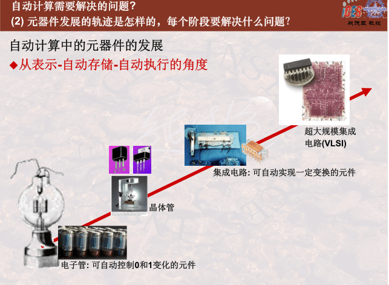
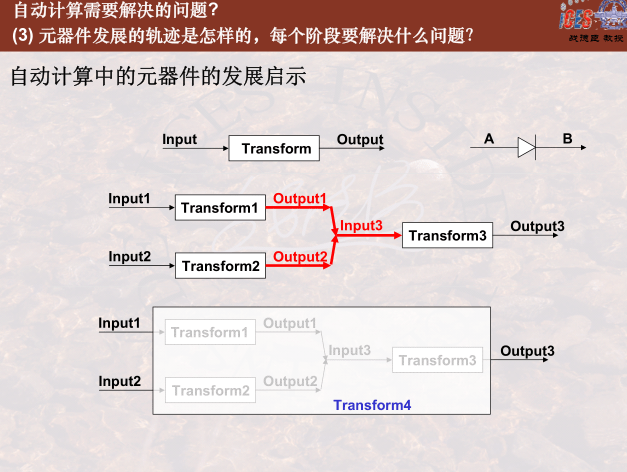
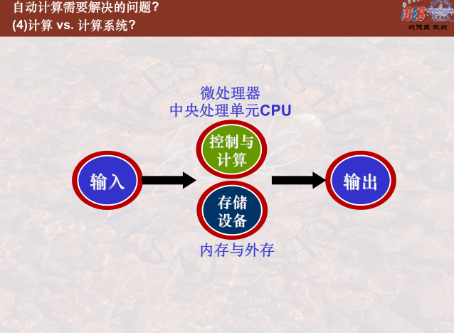
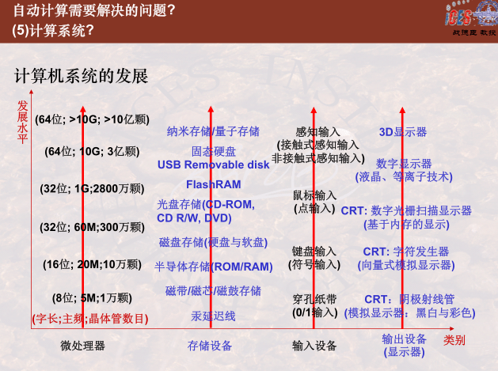

你造吗？机器要自动计算，那个年代得需要考虑多少问题啊！所以，你应该很庆幸自己能在这个时代能够领略科技的魅力……

## ★自动计算需要解决的问题？

### ◇一张图告诉你，有哪些问题

### ◇解释这张图

#### 没有数据和计算规则，你还是计算式吗？

任何一个计算式都包括数据和计算规则两个部分 。什么是数据？如这个方程式（看图）的a、x、b 、c、0这几兄弟就是数据。那么什么是计算规则呢？我们同样看这个方程，所谓的计算规则指的是这个方程是如何进行加法运算的？是如何进行乘法运算的？等等……

#### 机器自动计算？数据？计算规则？

如果想要机器自动计算的话，那么就必须解决「数据怎样表示的？」「计算规则又是怎样表示的？」这样的问题。

##### 如何表示数据？

举个栗子，如机械计算当中是如何表示数据的呢？

1. 算盘：上面一个珠子表示5，下面一个珠子表示1
2. 钟表：通过不同大小的齿轮来表示0~11这些数字
3. 巴贝奇差分机：同样是像钟表一样，通过不同大小的齿轮+不同大小齿轮上的位置来表示1~10这些数字

所以我们说怎样「表示」是一个很关键的方面。

**有种数据映射到了器件赶脚……**

------

有了表示以后，还要解决如何自动的存和自动的取的问题。即机器可以自动的读数据，也可以自动的写数据。如钟表可以自动的变化，而算盘就不可以了，需要人去拨珠子反映这种自动的变化，所以说算盘就不能实现自动的存和自动的取。

那么如何表示这种存取数据呢？，在现实生活中，能够找到表示10种状态的器件，通常来说是比较难的，而找到表示两种状态的器件，相对来说比较容易。所以从「表示」和「存取」的角度来讲，计算机就由10进制过渡到了2进制。人用十进制表达数值，而计算机则是用二进制表达这种数值，毕竟最主要的是，二进制的元器件容易找，借此我们可以实现自动的存和自动的取

**即便你的器件可以表示数据，但是能不能自动存取的是个问题，而这个器件能否找到、是否存在又是一个问题**

##### 如何表示计算规则？

那么计算规则又是如何表示的呢？

像是一些程序都是用来表示计算规则的，而程序也是需要自动的存和自动的取的，但对于程序来讲，还有一个更重要的是程序要能够自动执行

**不要以为你是个程序就可以了，即便你可以自动存取，但是你不能自动执行就是个屁！！！**

举个栗子？？

巴贝奇差分机，可以对那些计算规则，实现一定程度的自动处理。但是，对算盘来讲呢？只能通过人来执行这些计算规则

### ◇如何从元器件过渡到系统？

从十进制过渡到二进制以后，这对于电子计算机就比较容易了啊！为什么？找到有两种状态的元器件，我们就可以解决数据和计算规则这种存取的问题，将数据和计算规则都转化成0、1进行存取，我们只要找到能存储0、1的元器件就可以了，于是我们就可以过渡到了系统。

### ◇机器自动计算要解决的问题

通过上面叙述，因此可以有：**对于计算，我们要实现机器的自动计算就得要解决「程序」和「程序自动执行」的问题**

## ★元器件发展的轨迹是怎样的，每个阶段要解决什么问题？

### ◇自动计算中的元器件的发展

#### 解释这张图

这里说到电子计算机的发展过程，从「表示→☞自动存储→☞自动执行」的角度来看：

1. 最初研究的电子管可以控制0和1的读取

2. 到了晶体管，相较于电子管，体积就要小得多了，但是也能够进行0和1的处理。 **别看我小，力气可不小**

3. 最主要的发展，就是集成电路的出现，所谓的集成电路是基于这种0、1的运算，可自动实现一定变换的元件。图中那块橙色的小东西就是集成电路，而蓝色背景的东西，是打开集成电路后所看到的的东西，有一些元器件之间的相互连线，连线完后就封装起来，就留下了一些管脚暴露出来。而管脚是人们使用集成电路一个很重要的方面

   **这体现了封装和暴露的思想啊！这让我想起了JavaScript的闭包**

4. 对于现在来讲，就是超大规模集成电路，图中那块黑色的小东西就是它的庐山真面目，其旁边的是其内部的各个元器件以及元器件之间的连接关系

**这幅图应该可以说是元件器的发展脉络了**

### ◇自动计算中的元器件的发展启示

#### 解释这张图

从这种元器件发展当中，我们可以看到有这么一个规律我们是要理解的。

1. 我们首先有一些基本的元件，那么这些基本元件是能够完成由输入变换到输出的，我们已经知道，当然输入是一些0和1，输出也是一些0和1，而这些变换就是对这些0和1的运算
2. 进一步的说，我们可以用已有的元器件，如图中的T1、T2、T3，我们可以通过对T1、T2的输入输出再进行组合，如O1和O2作为T3的输入I3，我们就可以实现一些更为复杂的功能，得到更为复杂功能的输出O3
3. 我们通过对已有的元器件如T1、T2、T3，进行再一次的这种连接，把这种连接关系进一步的封装起来，变成了第四个元器件T4。

所以大家可以看到集成电路为什么越来越复杂，就是因为通过简单的元器件，通过连接起来以后，给它封装起来，完成一个变换。同理，然后这个元器件再参与新的构造当中，然后再封装起来。所以我们说这个集成电路越来越复杂。

**铁打的元器件，流水的参与和封装。东西的本质本来是很简单的，可是量多起来，就是质变了啊！**

## ★计算 vs 计算系统

### ◇解释这张图

#### CPU

在集成电路越来越复杂的助推之下，为此就出现了微处理器、中央处理单元（简称CPU，是计算机的一个核心部件，它通常控制程序的这种读取和程序自动执行，所以说CPU是计算机里面的核心部件，是控制、解释、执行程序的这么样一个部件）。

#### 存储设备

那么另外一个就是内存和外存了，即存储设备（主要用于存取0和1、存取数据、存取程序等等……）

#### 输入输出设备

再有就是输入设备和输出设备。前者将外界的信息送到计算机里面去，而后者则是将计算机计算的结果输出到外界来，由外界的人来感知。

#### 小结

我们说像这样（图中的内容）的一个部分，**就是计算机的一个基本的结构**，包括输入输出、CPU和内存外存等存储设备

## ★计算系统？

### ◇解释这张图

那么现在计算机的发展是怎样的？

#### 微处理器的发展

微处理器有三个主要的指标：

1. 第一个指标是字长：所谓的字长指的是这个CPU一次能处理的数据的位数，通常是二进制的位数。我们说一次能处理8位的，就是8位的微处理器，同理，一次能处理16位的，就是16位的微处理器。目前，有32位的，有64位的
2. 第二个指标是主频：所谓的主频指的是这个CPU在单位时间内，能够完成的操作的次数，通常用赫兹来衡量。早期是5MHz，到现在的20M、60M、一个G等等这样的一些速度越来越快。所以主频是衡量CPU运算速度的一个指标
3. 第三个指标则是这个CPU内部集成了多少个晶体管，由图可见，其数目也是在不断的变化当中，由最初的1万颗到现在的数以亿计……

这就是微处理的发展

#### 存储设备的发展

由最初的汞延迟线到现在的固态硬盘等等

#### 输入设备

由穿孔纸带到现在的感知输入等等

#### 输出设备

由最初的阴极射线显像管到现在的三维显示器

#### 小结

我们可以看到X轴这几个部分，分别是计算机的几个核心部分或者说核心的部件。我们可以把下面的当作是早期的计算机。而上面的则是现在的计算机。通过这个图可以看计算机（停顿，不是计算机系统而是系统的）系统的发展，我们在这里面只是简略地给大家做一个介绍。

## ★总结

- 什么是计算式？没有数据和计算规则，那么你就不是计算式。需要实现机器自动计算，就必须要得要解决数据和计算规则如何表示的问题。而数据的表示可以通过器件来表示，可是这个器件需要一些内涵的，比如简单（二进制）和能够自动存取（有个BOSS可以控制数据的存取？？？）

  程序是什么？用于表示计算规则的，那么这些程序（可以说程序也是一种数据）是如何存储的呢？0和1的存储咯……可是有了这些0和1（程序），如何自动执行呢？

  最近在学CSS，而CSS是不正交的，有时候你不知道这个属性会带来些影响，或者你认为是一个属性的结果，其实是多个属性组合起来的结果，我昨天看了王垠的一篇博客——[DSL](http://www.yinwang.org/blog-cn/2017/05/25/dsl)，其中说到CSS是DSL，或许只有CSS的设计者才知晓为什么会有这样的结果。为什么这样改了，就可以了呢？不知道，当然，你可以去问CSS的设计者。

  你写的CSS的demo，是基于某种计算规则的一堆数据，这堆数据是如何自动执行的呢？问浏览器，它会告诉你

  我再次感受到了，这门课程所告诉的「什么叫站得高看得远」

- 计算机的一个基本的结构——CPU、外存内存、输入输出设备

- 一个基本的元器件是能够完成由输入变换到输出的，元器件的相互组合，然后封装成一个具有特殊操作元器件，然后这个元器件又参与其它的封装，于是这个新出现元器件又更为强大了啊！最终的结果就是集成电路越来越复杂……

