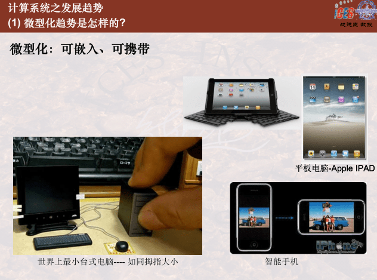
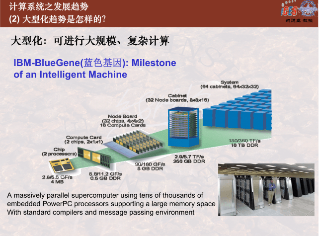
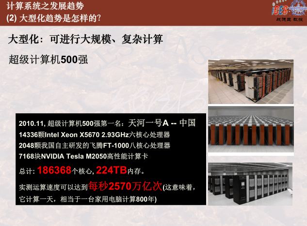
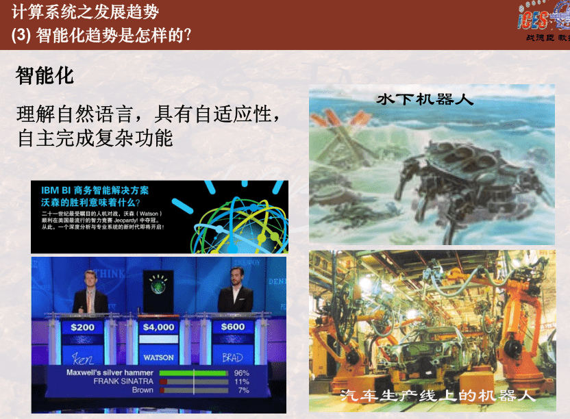
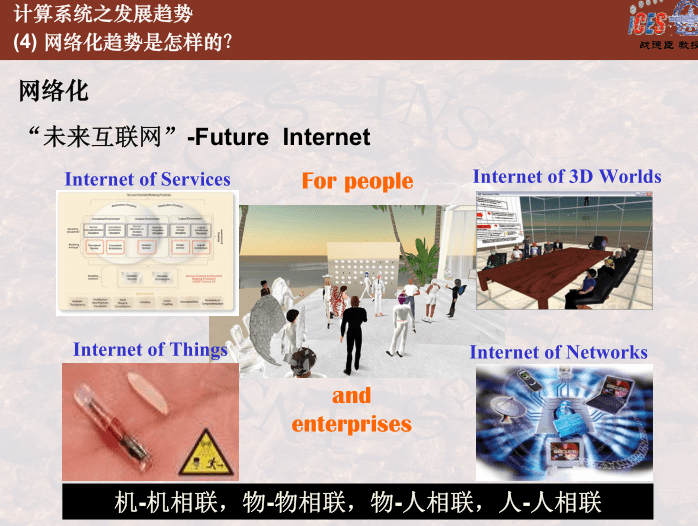

我们说计算系统、计算机系统向哪个方向发展呢？我们可以概括的来讲，会向这几个方面发展……一个是微型化，一个是大型化，一个是智能化，还有一个是网络化……

## ★微型化趋势是怎样的？

### ◇解释这张图

现在的计算机可以越做越小，可以嵌入，可以携带（图中，拇指般大小，想想都不可思议！！！）。所说的嵌入指的是可以嵌入到任何设备当中，可以嵌入到任何的这种系统当中。而可携带，换句话说，就是我们可以随身携带，便携式！如可以做在手机当中，还有诸如IPAD等各种各样物体当中……那么这是计算机微型化的一个趋势，也是一个优势。正因为有了这种微型化，使得现在的计算机，使得各种各样的这种物体都可以被连接起来，都可以被识别，都可以被计算机来处理，这就是所谓的微型化……

## ★大型化趋势是怎样的？

### ◇解释这张图

计算机系统的规模可以发展的越来越大，可以进行大规模，复杂的这种计算。那么这种大型的计算机是怎么发展起来的呢？

举个栗子：

#### IBM-蓝色基因

[IBM的蓝色基因](https://baike.baidu.com/item/%E8%93%9D%E8%89%B2%E5%9F%BA%E5%9B%A0%E8%B6%85%E7%BA%A7%E8%AE%A1%E7%AE%97%E6%9C%BA/11002670?fr=aladdin)是一台划时代的超级计算机，当然这是2005年11月宣布的。（[2018最新世界超级计算机TOP10！](http://baijiahao.baidu.com/s?id=1600186340312901537&wfr=spider&for=pc)）。

1. 它的最基本的部件就是一个微处理器（叫它C），把2个C做到一块片子上面，我们说这是一个微处理器片。
2. 进一步进化就是把片做成卡了，这个卡从图中可以看出，装了两个芯片
3. 继续进化就是把卡装到一个槽/盒子里面，可见可以插入若干个卡
4. 把若干个槽摞起来就是个机柜，或者是个小屋子

现在的大型计算系统，尤其是云计算系统、数据中心，它的背后可能会有几十、几百、几千、几万个这样的机柜，由此构成了这种大型的基础设施、大型的计算设施

这就是所谓的计算系统大型化，它广泛用于什么地方呢？比如气象、军事等等方面的这种「模拟、运行」这样一些的工作当中去。

------

ps：

图中的那句英文，用有道翻译如下：

> 一个大型并行超级计算机，使用成千上万的嵌入式PowerPC处理器，支持使用标准编译器和消息传递环境的大型内存空间

大致理解一下就是，一个大东西的出现，需要很多小东西的嵌入，为此具备了一些不明觉厉的功能……

### ◇超级计算机500强

目前，有很多国家都在研究这种超级计算机，每天都进行这种超级计算机的评审，而我们国家的这台天河一号就是很吊炸天的（目前2018年的500强排名是，中国的“神威·太湖之光” 排名第二。）。由图可见，天河一号的规模大到是什么程度。可见，这可以告诉我们这种超级计算机的大型化， 是怎样的发展、是怎样的一个规模，这是我们可以看到的。

## ★智能化趋势是怎样的？

### ◇解释这张图

所谓的智能化，也就是说现在的计算机能够更好的理解自然语言，更好的具有这种对环境的自适应性，如随着环境的变化，它可以作出一些调整。还有它可以自主的完成一些复杂功能，比如说：

1. 汽车生产线上的机器人，它们是自主的，通过它们这种计算机系统的自动化控制来装配一台汽车，这样的一条生产线，实际上也体现了一种智能化的程度，还有自动化的程度

2. 水下机器人，如何面对复杂的环境，进行处理？这也是一个体现智能化的方面

3. 代表计算机智能化之一的IBM的沃森计算机，这台计算机在一档智力竞赛当中，于人类的比拼中夺冠，而且是碾压的局面。主持人采用英语提问，那么沃森计算机就得要像人一样去理解主持人问的问题才行，接着就得要到它后面的大型数据库中进行数据的搜索，找到满足主持人提问的答案，然后展示出来。可见，沃森这小子，不仅具有复杂的计算能力，同时还有一些对自然语言的理解能力、翻译能力，而且还包括对后台数据的这种快速检索能力，以及对答案的匹配能力等等……从这些方面，实际上这体现了人工智能的一些发展成就，当然同时这也是大型计算机计算规模的一种体现，这就是它的一种智能化

   **这个沃森，让我想起了「蒙面唱将」的那个机器人，它根据选手的音色去分析、检索、适配，然后得出这位选手是何许人也，至于命中率是多少？我也不清楚**

## ★网络化趋势是怎样的？

### ◇解释这张图

大家都知道，互联网现在已经吸引了越来越多的人的重视，几乎现在所有的人都通过互联网在生活，比如：通过互联网进行购物、娱乐、观赏电影、戏剧等等……我们说除了互联网以外，现在大家可以看到各种各样的物体都可以基于互联网连接起来，这样的话我们可以做到远处的追踪，如在网上买了个东西，这个东西配送到哪里啊？我们可以通过物联网快速获得它的这种信息，识别它的这种位置等等……

#### 服务的网络

日常中，有各种各样的服务公司，其中，尤其是基于互联网这种服务公司，它们之间相互连接起来，为用户提供 了一个错综复杂、功能强大的这样一个服务网络

#### 三维世界的网络

我们说现在的互联网世界，是个三维的世界，是个虚拟的世界。这些虚拟的世界通过互联网连接起来，那么不同的人所处于不同的世界当中，他们就可以通过这种虚拟世界进行交换，进行交互，进行沟通，进行生活、进行娱乐等等

#### 网络的互联网和社交网络的出现

我们说现在的这种互联网，还可以把网络「如各个组织网络、社会/自然网络」有机地连接起来，就形成了一个网络的互联网。当然这样一个互联网，一方面是为人来提供服务的，它把所有的人给它连接起来，那么这就构成了我们现在所说的社交网络。

**这里说的组织网络、社会/自然网络应该是现实中的网络吧，把这种网络和虚拟的网络有机结合起来就有社交网络等等这样一些的概念**

社交网络是互联网的这种使用者、发布者、接收者相互之间关联起来所形成的一个网络，这是社交网。

大家知道现在的很多的活动都可以通过社交网络来进行组织，来进行这种活动，来进行联络。那么**这种社交网络实际上也开辟了人类沟通联系的一种新的方式，新的方式。**也使得**现在越来越多的人都在关注如何根据互联网来判断人类的这样一个行为，发展的这样一些趋势。**

#### 互联网与企业的联系

当然现在的互联网，我们说也是和企业密切相关的，企业是社会的主体。那么各个企业之间通过互联网相互连接起来，形成了产业链，形成了供应链，形成了生态链，这是我们在这里面可以看到的。

#### 未来互联网的概念

基于上面出现的网络，所以欧盟提出了未来互联网的概念，提出了**未来的互联网应该是一个物联网、服务网络、组织网络以及虚拟的网络的一个互联网。**而且更重要的是在这些互联网的背后，它们有一个这种庞大的一个社交网络，关联到每一个成员，关联到每一个组织，这是未来互联网的这样一个概念。**那么它的目标是实现机-机相联，物-物相联，物-人相联和人-人相联。**

### ◇智慧地球

IBM在这个基础（未来互联网的概念）上，实际上提出了智慧地球的概念。那么这个智慧地球实际上有三重含义，这对于我们来说是要理解的。那么有哪三重含义呢？

#### 可感知（Instrumented）

一个就叫做可感知，也就是说在地球上各种各样的这种物体都是可以被感知的，都可以把它这种信息传递到计算机系统，传递到计算系统中的。

#### 可互联（Interconnect）

那么第二个来讲，我们说叫做可互联。啥意思？？？指的是所有的这种物体、所有的计算机、所有的系统相互之间都可以互联互通，正是因为互联互通才使得不同地区、不同时空这样的一些人员相互之间可以有效的这种沟通，如获取信息、处理信息、显示信息、展现信息等等。

#### 智能化（Intelligent）

那么再有一个就是在这种可感知、可互联基础上，实现一种智能化。所以**IBM把它（智慧地球）称为叫3I**。

#### 智慧地球一个基本的结构

右侧这个图给出了一个智慧地球的一个基本的这样一个结构。那么在这个结构中，大家可以看出什么名堂出来？

##### 底层-云计算环境

大家可以看到最底层的是一个云计算环境，也就是说一些大型的计算基础设施。

##### 中间层-搞事情

在中间这一层来讲，包括一些智慧地球的一些基础施设，包括一些感知设备等等，那么再有一些我们说就是一些这种数据的管理网络的管理，那么还有一部分就是要有个平台。

通过这个平台来讲，我们可以实现面向各行各业的这样一些这种智慧的服务，那么这些服务也有的称为叫做**云的服务**。现在基于云，也就是说基于后面这种大规模的计算设施，那么面向用户，你想用多少，你就可以用多少，像用水用电一样来使用这些计算设施，来使用这些计算资源。

比如说：

就像我们现在大家看到我们所有的照片都可以存储到网上，那么存储到哪儿去？实际上就是存储到网上的这种云计算设施当中，那么通过这样一个平台，我们可以浏览我们的照片，可以发布我们的照片，可以传播我们的照片，这是一个典型的这种云的这样一个应用。

除了以上叙述的内容以外，这个智慧地球它实际上是可以改变社会/自然网络的，比如说改变这种交通网络，当有了我们说这种云计算设施以后，我们这个交通的拥堵现象能不能够解决呢？我们的这种电力不平衡的状态，有没有可能解决呢？

比如说：

在用电的时候，用电的高峰可能电不够用了，但是在不用电的时候呢，即停峰的时候，我们这个电可能就消耗不出去了，**我们要像在这种情况下，能不能借助于这种智慧地球、智慧星球这样一种思想来改善呢？实际上这就是IBM提出智慧地球的这样一个基本的这种思想，这也可以看得出来未来的计算系统向何处发展。**

### ◇小结

那么综合我们上面讲的未来的计算机系统，它是向我们说微型化、网络化、智能化，还有我们说的这种大型化方向去发展，我们在后面的课程当中还会继续学习相关的内容。

## ★总结

- 这样记笔记效率太低了，我需要一句话概括每个小点告诉了我什么东西，为此我需要反复的练习反复的听，而不是听几个字就敲几个字
- 计算系统、计算机系统朝哪些方向发展？微型化、大型化、智能化、网络化……

