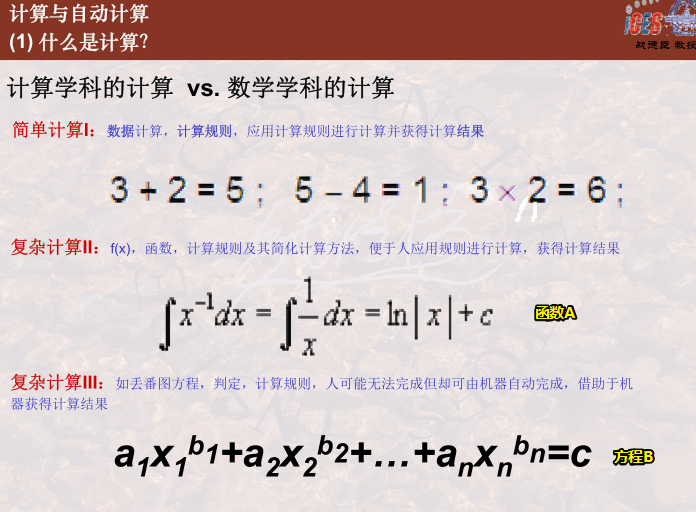
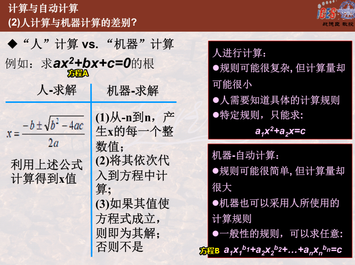
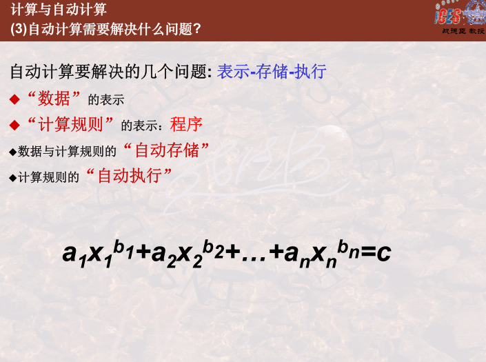
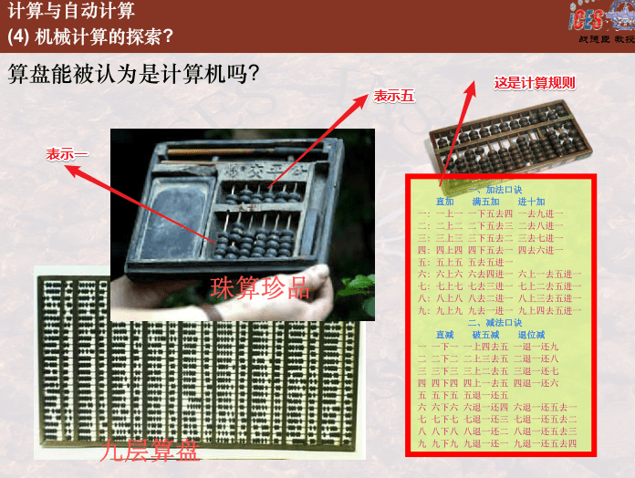
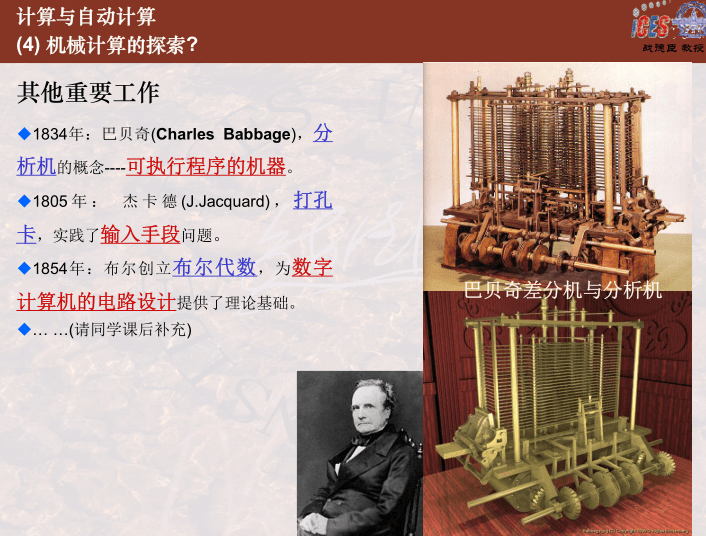
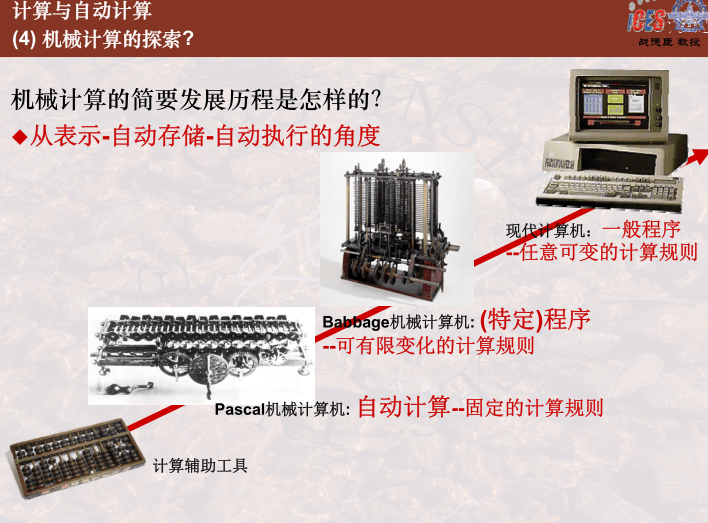
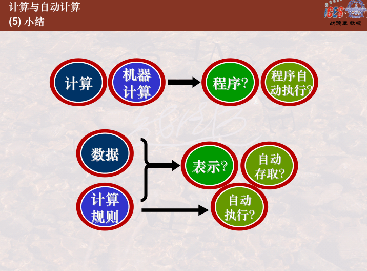

有两门这样的课程：[大学计算机—计算思维导论](https://www.icourse163.org/course/HIT-7001)和[计算机专业导论](https://www.icourse163.org/course/HIT-437006?tid=1002251019) 。它们存在交集，而且老师都是战老师，前者相较于后者详细很多。我都不知道看哪一门课程好了，毕竟后者是遵循着这个[路线图](http://study.163.com/curricula/cs.htm)来学的……

## ★什么是计算？

什么是计算呢？计算学科的计算与数学学科的这种计算有什么差别呢？

题外话：

昨天看了王垠这篇文章「[数学和编程](http://www.yinwang.org/blog-cn/2015/07/04/math)」，我会相信他所说的观点，至于他的观点正确与否（可以看[这个](https://linux.cn/article-6714-1.html)捋捋，文章底部有评论）？我就不去关心了。毕竟这解决了「自己不懂很多数学而烦恼 」的问题，就像他说的建议一样「先学编程，再去看数学 」。

回到本讲内容：

### ◇简单计算Ⅰ

我们说我们从小学到初中都在学习计算，最典型的，比如说3+2等于5，我们学的是什么呢？**我们学的实际上是一些规则，我们要学习如何应用这种规则来获得计算的结果，目的是使人能够根据这种规则能够计算出结果，这是一种计算。**

### ◇复杂计算Ⅱ

这种计算（看图——A）是我们在大学来学习的，中学到大学也不断在学习的，类似于我们说像这种情况：

一种函数，通过改进一些自变量的一些值，我们可以算出这个函数的值，我们说这也是一种计算。那么**这种计算通常我们要学习的是如何用这种函数来表达一个问题，一种现象。以及学习这种函数，如何通过一种简单的方法使人可以掌握，使人可以计算出它的这种结果来。这是我们说数学上的计算。**

### ◇复杂计算Ⅲ

还有一种计算（看图——B），大家可以看，像我们说这样的一个方程，那么对于这个方程来讲，我们如何求解呢？那么应该说这个方程的形式我们是知道了，但是如何求解？我们可能**找不到一些快速的办法，或者说让人快速的给它计算出来。**那么这个时候我们怎么办？这个时候我能不能够**用一些简单的规则让计算机重复的去执行，来得到计算结果**了，这也就是说**设计一些简单的规则，这个简单的规则可以让计算机来自动的来执行，然后计算机不断地重复的这种计算得到结果**。那么也就说**这样的一种计算，规则可能很简单，但计算量却很大，人是做不出来的，是让机器自动来做，这也是一种计算**。

------

**「人计算」是数学学科要研究的内容 ，「让机器自动计算」则是计算机学科要研究的内容** 

------

## ★人计算与机器计算的差别？

我们给大家举个例子来看人计算和机器计算的这样一个差别。

### ◇人求解

比如说我们现在要求方程A的根，我们人求解的话，因为数学方法已经告诉我们这个一元二次方程了，我们可以直接用这样一个公式（求根公式）来进行计算，获得它的根。

### ◇机器求解3

但是对于机器来讲，我们可以完全采用另外一种方法来进行求解，比如说从-n到n产生x的每一个整数值，那么将其带入到这个方程当中，那么使得这个方程为零的所有的这种根，所有的这种x值，这就是我们要找的值。

### ◇小结

所以大家可以看，在这里面，人进行计算，规则可能很复杂，但是计算量可能很小，人需要知道具体的计算规则。另外一个来讲，我们说这些规则可能是一些特定的规则，比如说像我们说这个方程（方程A）的这种求解公式只适合用于一元二次方程，那么对于任何方程它适不适合呢？我们可能不知道。但是对于机器来讲，大家知道我们说规则可能很简单，但计算量却很大，机器也可以采用人所使用的这种规则把它变成一种规则，让机器来求解也是可以的。那么另外一个大家可以看到，对于机器求解来讲，这样的一种思维，我们可以对任何的这种方程，比如说下面这个方程（方程B）都可以进行求解，这是大家可以看到人计算和机器计算是有差别的，所以它的思维也是有差别的。

------

 **如果机器想要使用人复杂的规则的话，那么途径就是程序。了解机器的机械规则，对于你理解程序极为重要，如对V8引擎（虽然V8是个程序）有了一定的认识，那么JavaScript这门语言就不在话下了**

就像这句话说的一样：

> 哲学是什么？它使我们对过去熟悉的事物与观点陌生了起来，颠覆了我们的既成观念。一旦熟悉的变得陌生，一旦我们开始反思我们的环境，世界将从此不再一样。

**一旦你开始反思JavaScript运行的环境，你会发现你看JavaScript的眼神也不对了，你似乎可以站在更高的角度去理解JavaScript这门语言（即便它的设计是有缺陷的），从而对过往不理解的demo，有了新的认识**

------

## ★自动计算需要解决什么问题？

基于上面的内容，得到「自动计算需要解决什么问题呢？」这样的一个问题。我们通常来看自动计算要解决如下几个问题：

- 第一个就是数据怎么是表示的？
- 第二个它的这种计算规则如何表示？我们说这就涉及到程序的概念。
- 第三个来讲就是计算规则与数据怎么样自动存自动取，这就涉及到了存储器。
- 还有一点就是计算规则的自动执行问题。**那么能不能够自动执行，则是衡量是不是属于计算机的一个很重要的一个标志。**

能否举几个栗子来说明这个（上一行加粗的部分）观点（自动执行？计算机？一个重要标志）？请看下面的内容：

## ★机械计算的探索？

### ◇算盘

比如说算盘能不能被认为是计算机。我们来看算盘呢……它能够表示数据，上面表示五，下边表示一，那么有不同的进位。那么它右边呢？给我们了一套计算规则，那么这套计算规则应该说是人可以掌握并运用来进行计算的一套规则。但是对这套规则来讲，机器，也就是我们这个算盘是不能够执行的。所以我们说**算盘通常可以被认为是一种辅助的计算工具，还不能被认为计算机**。

### ◇帕斯卡计算机

那么真正的计算机被认为是计算机的，我们可以称为叫做帕斯卡计算机。这是帕斯卡（看图），这个人很厉害，我们说后边有一种语言，我们也把它称作PASCAL语言，主要就是为了纪念他的这种功绩。他设计并制造了一台俗称叫做帕斯卡机的一种机械计算机，这是它的一种形式（看图）。那么在计算机里面，我们说用齿轮的这种啮合来表达了十进制数之间的关系。它通过这里面的一些机械机构的这种传动可以执行简单的加法运算，这是它的一种一个基本的原理。我们说帕斯卡机它的深刻意义在哪里呢？它实际上告诉我们**用纯机械的装置可以代替人的思维和记忆，开辟了自动计算的道路，所以说它是一种自动计算的这样一个开拓者。**

### ◇莱布尼茨

莱布尼茨在它（帕斯卡计算机）的基础上改进了这种计算机，他使得这种计算机通过这种步进轮的这种引进，可以实现连续、重复的、自动的计算。

这是莱布尼茨改进的这种计算机（看图），莱布尼茨在改进这种计算机的时候，进行了这种思考→☞感觉到基于十进制的这种计算机器，它这种设计应该说是非常复杂的，因为十进制这种计算规则比较复杂，所以他在设计的过程当中就有所体会，他也参考了我们前面看到的这种中国的这种易经，所以他在思考能不能用二进制来设计机器呢，所以他后来就专注于研究基于二进制的这种计算规则，那么后来又提出了数理逻辑等等，应该说**莱布尼茨做的这种探索的工作是值得我们学习的**。

------

这个小节，让我想到「站在巨人的肩膀上前进」这句话，进一步提出疑问「似乎现在很多的东西都是基于前人的努力而得来的？？」，于是基于谷歌搜索的得到一个问题：[站在巨人的肩膀上，如果巨人错了呢？](https://www.zhihu.com/question/36972973)

我竟然没有提出「巨人假如是错的，而且是根本的错误」这样的疑问，这让我感受到自己依旧菜得抠脚啊！！！

其中有这么一个答案：

> 站在巨人的肩膀上，如果巨人错了呢？ - 反正你不认识我的回答 - 知乎 https://www.zhihu.com/question/36972973/answer/71194099 

这其中有两句话很有味道：

一句是：

> **我不喜欢巨人的这个比喻，不过这个问题问的不错，让我们这么想吧。我们所追求的发现如同在黑夜里寻找金币，而过往的paradigm就是我们的灯。有些人把这灯当成了路灯来用，只在光下寻找，视野便被困住，即便光照的位置是错误的。有些人把这光当成手电筒，在照亮不到的时候便即时调整，这才是科学，这才是我们该做的。**

另外一句是：

> 不要把现代科学放上神坛，也不要去鄙视那些曾经的落后想法，他们不过都是我们必须要走的路而已。**没有人因为今天的太阳，而鄙视昨日的晚霞。** 

 我在学前端的时候，就充斥着技术迭代更新的很快的气息，随着而来的就是对旧技术的一种鄙视。

我觉得这是可以有的，毕竟这些语言的设计，这些问题的解决方案等等，在那个时间段里，我想是最好的做法吧！我会去试着拥抱变化，因为这些变化和规则，在我看来都意味着一种进步，不过在此之前，你必须有这么一个认识「探索问题的解决方案的过程是值得学习的」，而不是依葫芦画瓢，输入一个做法，然后输出一个结果就了事了……

------

### ◇其他重要的工作

在这种自动计算的探索当中，还有很多的人，比如说我们图中右侧的这个巴贝奇差分机与分析机，巴贝奇**穷尽一生**在做一台可以自动计算的这种机器，而这种计算机器可以通过这种差分的原理来实现一些复杂函数的这种计算，应该说它是可以具有一定可变规则的这样一台计算机，换句话说是可以执行程序的一台计算机；

还有很多人，比如说一些输入手段的研究者研究这种打孔卡，那么在一张纸带上有孔的时候表示输入的是一，没有孔的时候表示输入的是零，那么通过有孔没有孔就可以解决了输入的问题，这也是基于二进制的。

当然我们说还有一些比如像布尔，那么他研究了基于二进制的这种电路的设计，所以使得数字电路这种设计取得了今天的这样一个成就，应该说它的功劳是不可磨灭的。现在我们说把这种代数称为叫做布尔代数，很多的这种量，我们称为叫做布尔量、布尔逻辑等等，都是为了纪念他的，大家可以在后面的这种复习当中查阅网络资料来学习，还有一些其他的工作。

------

**这让我想起那句话「从1到100很容易，难的是从0到1」……**

知乎上有这么一个问题：

传送门：[为什么近 20 年科技发展的特别快，完全是爆炸式的飞跃？](https://www.zhihu.com/question/22166777)

近几年来的发展，在感官上的刺激尤为的强烈，我不知道后十年会是怎样的，很期待但也很焦虑……

------

### ◇机械计算的简要发展历程是怎样的？

我们说用机械计算它这种简要的历程，我们可以看算盘，只能说是一个辅助的工作。

那么到了帕斯卡计算机，我们说开辟了一种自动计算的道路，但是这个帕斯卡计算机它只能实现一些固定的计算规则。

那么到了巴贝奇机械计算机，我们说它可以执行一些可变的计算规则，也就是说可以实现一些特定程序的这种计算。

我们说到了现代计算机我们可以执行任意程序任意可变的规则，这是我们现代计算机。这是从表示自动存储、自动执行的角度来看机械计算它的这样一个发展的历程。那么我们可以看到这个发展的历程对我们来说应该是有所启示的。

## ★小结

我们总结一下我们刚才讲的内容，我们给大家介绍了什么是计算，什么是机器的自动计算，在这里面就涉及到了计算规则，涉及到了程序，又涉及到了程序的自动执行。

那么对于这种计算规则来讲，我们可以分成两个方面，一个是要研究供人来使用的这些计算规则，以便人可以通过这些计算规则，通过较小的计算量获得计算结果，这个方面我们说应该是数学家研究的内容，而另外一方面这些计算规则我们可以设计一些简单的，但是可以让机器重复执行的不断重复的执行，那么**这是我们说我们计算学科要掌握的，也就是说我们要掌握，可以自动执行的一些计算规则它的这种表示，它的这种自动存取问题**。这是我们今天给大家介绍的内容，尽管有些内容比如说像程序如何自动执行，我们还不太明白，没有关系，我们后面的课程当中会继续学习这些内容。

## ★总结

- 自动计算要解决的问题：
  - 数据是如何表示的：0和1
  - 计算规则是如何表示的：程序
  - 数据与计算规则是如何自动存储的？？？
  - 计算规则是如何自动执行的，把「计算规则」替换为「程序」，进而衍生出程序是如何自动执行的

## ★Q&A

1. 运用和应用的区别？

   运用----指把某种东西用于预期适合的某一目的或某人。 应用----一种技术、系统或产品的使用。 后者在很多情况下都用得上，这意味着使用率比较高，而且还可以和其它词构成名词性词组，如「应用数学」、「应用经济学」等等；前者一般指灵活、巧妙地使用之意，偏正关系，褒义词。 （主要表现出”灵“和”巧“） 

   参考：[运用和应用有什么区别？](https://zhidao.baidu.com/question/281658477.html)

