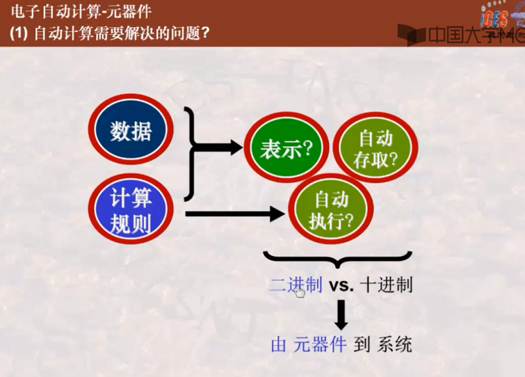
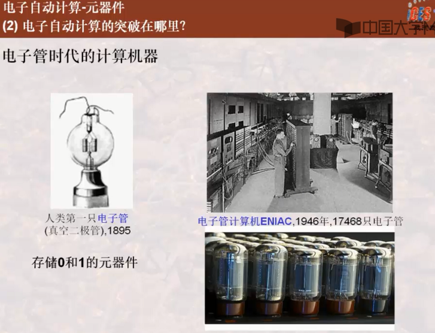
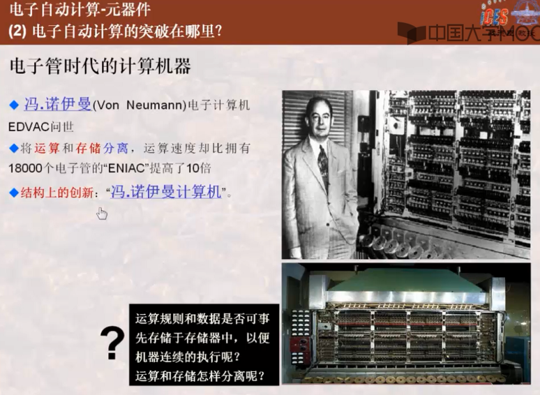

# 电子自动计算-元器件

## ★自动计算需要解决的问题？

莱布尼茨在研究的过程当中，发现十进制的计算规则很复杂！

那么能否用二进制来取代十进制，借此来用于计算、自动计算这种研究呢？

为此，人们就在此基础上，不断地去研究二进制的一些元器件，到 「系统」该如何来做！

接下来，我们先看看元器件是如何解决的？

## ★电子自动计算的突破在哪里？

首先，人类发明了一种电子管，采用电子技术可以实现0和1，所以说这个电子管就是存储0和1的这么一种元器件！

通过右下角那幅图所描述的电子管，我们可以借此来设计一台比较早的电子计算机ENIAC

不过，所需要的电子管，接近20000个啊！可见，它的体积也显得忒大了吧！

